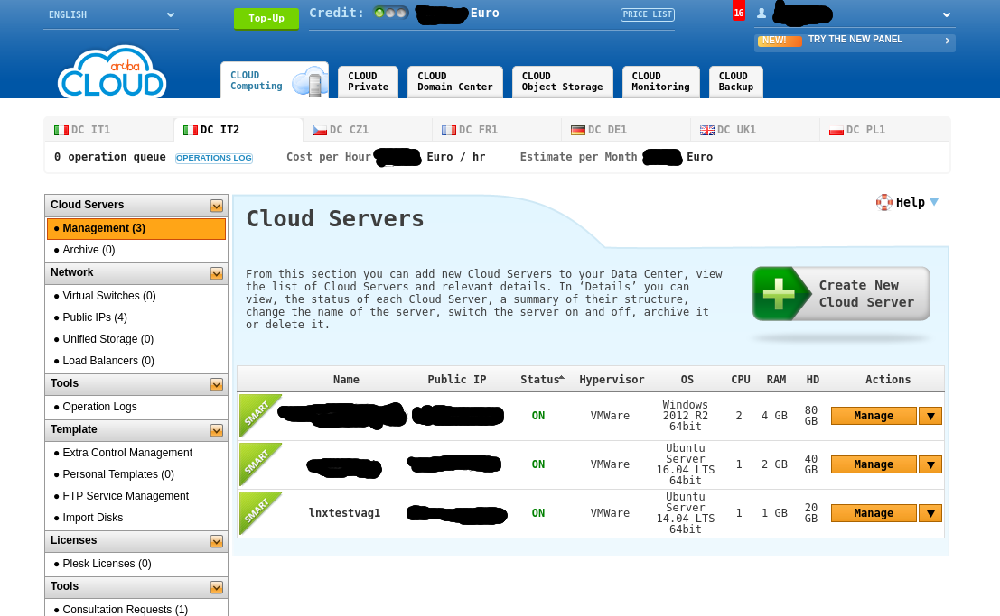

# Vagrant ArubaCloud Provider

-Update version : 0.0.5  


## Table of Contents
* [Overview](#overview)
* [Features](#features)
* [Installation](#installation)
* [Update](#update)
  * [New and changed options](#new-and-changed-options)
  * [Available options](#available-options)
* [Quick start](#quickstart)
* [Example Usage](#example-usage)
  * [List Templates available](#list-templates-available)
  * [Create and Start VM](#create-and-start-vm)
  * [View VM from web](#view-vm-from-web)
  * [Reload VM](#reload-vm)
  * [Provision in VM](#provision-in-vm)
  * [Destroy VM](#destroy-vm)
  * [Snapshot VM](#snapshot-vm)
      * [Create](#create)
      * [List](#list)
      * [Restore](#restore)
      * [Delete](#delete)
  * [View VM running in my Arubacloud](#view-vm-running-in-my-Arubacloud)
* [Appendix](#appendix)
  * [Example Vagrantfile to list arubacloud servers templates](#example-vagrantfile-to-list-arubacloud-servers-templates)
  * [Example Vagrantfile type smart basic](#example-vagrantfile-type-smart-basic)
  * [Example Vagrantfile type smart with syncing and provision example](#example-vagrantfile-type-smart-with-syncing-and-provision-example)
  * [Example Vagrantfile type pro](#example-vagrantfile-type-pro)
  * [Example multi machine](#example-multi-machine)
      * [Commands](#commands)       
      * [Vagrantfile](#vagrantfile)         
  * [Vagrant option supported and not](#vagrant-option-supported-and-not)
  * [Error messages](#error-messages)
  * [Development](#development)
  * [License](#license)


## Overview


This is a [Vagrant](http://www.vagrantup.com)  plugin that adds ArubaCloud provider 
to Vagrant, allowing Vagrant to control and provision machine in ArubaCloud IaaS Service.

## Features
* Boot ArubaCloud instances.
* SSH into instances.
* Provision the instances with any built-in Vagrant provisioner.
* Specify which datacenter you want to use with a simple prefix.       
* Configure multi machine architecture (an example of configuration is provided)   


## Installation
Install using standard `vagrant plugin install` method, since the gem is published in  
 [central RubyGemsrepository](https://rubygems.org/gems/vagrant-arubacloud)

```
$ vagrant plugin install vagrant-arubacloud
```


___________
## Update


### New and changed options   
(in config *:arubacloud* block)    


- the command  **vagrant arubacloud servers** has been extended:
   *  is added the DC (DataCenter), the 'id' of the server, the description of the status(run, stop ... etc).      
   *  the name of the node is highlighted to see if it has been defined in Vagrantfile.   

- option  **admin_password**  has been removed and replaced by the directive :     
    'nodename'.ssh.password     

- option **reload** is now implemented and available; this option execute a simple      
     *power off*   ( it's a 'reboot' and not 'power-off' forced)   
     *power on*    

- after vagrant command 'up' and 'reload', is executed a synced_folder    

- option **snapshot** is now implemented and available; this option execute a snapshot
of server:


| Type| Command | description | status server |
| --- | --- | --- | --- | 
| `create` | *vagrant snapshot -t create -n 'server_name'* | create a snapshot of vm |  running |
| `delete` | *vagrant snapshot -t delete -n 'server_name'* | delete snapshot of vm | any |
| `restore` | *vagrant snapshot -t restore -n 'server_name'* | restore vm from snapshot | power off |
| `list` | *vagrant snapshot -t list -n 'server_name'* | list info relate snapshot of vm |  any |

*Note*
1.  *if the 'snapshot  ... restore ... ' is executed, once the command is finished, after a few seconds the snapshot is automatically deleted*    


- option **package_id** is changed.     
  Valid values now are :'small', 'medium', 'large', 'extra large' 


|   package_id     |CPU 	| Ram (GB)          | Disk Size (GB) |
| --------------------------------|--------------------| ------------------------------ | -------- |
| `small`	          |1			     | 1           		| 20      |
| `medium`       	   |1		    | 2         		 	| 40      |
| `large`        	   |2			| 4            | 80      |
| `extra large`                  |4	| 8              	| 160      |


- added a new parameter:   
     **endpoint**  
  for provider *:arubacloud*   
  this parameter define what is the DataCenter Aruba can be used for the defined VM in Vagrantfile ; valid value are:   dc1, dc2, dc3, dc4, dc5, dc6, dc8
  (default:  dc2 )   


| Parameter |                 Data Center Location                 |
|-----------|------------------------------------------------------|
| `dc1`     | Italy 1                                              |
| `dc2`     | Italy 2                                              |
| `dc3`     | Czech republic 									   |
| `dc4`     | France                                               |
| `dc5`     | Deutschland                             			   |
| `dc6`     | United Kingdom                            		|
| `dc8`     | Poland                    |


- the parameter:  

      **nodename.url**   

  if used can override the 'endpoint' value.      
  This parameter should only be used in case of new 'dc*'not yet included in this plugin.        

- The very important's messages has the name of DataCenter where the VM running : [dc?] in row displayed ( 'up', 'reload' , 'halt', 'arubacloud servers/templates', 'destroy', 'snapshot') 
  

Together with the package are provided some 'Vagrantfile_*', as an example of basic configuration , minimum configuration for consulting existing servers/templates in Arubacloud, configuration with syncing_folder and a simple shell for provisioning, multi-machine configuration with multiple VM .


___________
### Available options   
(in config  *:arubacloud*)   
__________

- **service_type** = this is the 'code' (is a numeric value) of  hypervisor used (in  Arubacloud )  
Valid values are:

| code | hypervisor | service type |  
| --- | --- | --- | 
|  `1` | Microsoft Hyper-V  | Cloud pro  |
|  `2` | VMWare  | Cloud pro |
|  `3` | Microsoft Hyper-V Low Cost | Cloud pro |
|  `4` | VMWare  | Cloud smart |

- **server_name**         = is the name of server ( is name listed in arubacloud web interface) 
- **arubacloud_username** = is user account to access arubacloud 
- **arubacloud_password** = is password of account to access arubacloud  
- **url**                 = url of the web service to use ( *DEPRECATED*) 
- **template_id**         = The ID of the template to use ( read the next notes to determine the correct value) 
- **cpu_number**          = Number of Virtual CPU to be assigned to the VM only for service type not smart 

| descr | n (number) of CPU) |
| --- | --- |
|  Pro VMWare | 1 < `n` < 8 |
|  Pro Hyper-V | 1 < `n` < 4 |

- **ram_qty**             = Amount of GB of RAM to be assigned to the VM (n  <= 16) only for service type not smart
- **hds**                 = Array containing hard disk Configuration only for service type not smart:

*Example configuration (size is expressed in GB):*   
       *hds* = [{:type => 0, :size => 100}, {:type => 1, :size => 200}]   

*Note*
1.  *Hd type 0 is required because specify the first hard disk, max size per hd: 500 GB)*  
2.  *Hd type > 0 < 4 are 3 additional hard disks (optional)*     


_______________________________________


## Quickstart
After installing the plugin (instructions above), the quickest way to get
started is to actually use a dummy ArubaCloud box and specify all the details
manually within a `config.vm.provider` block. So first, add the dummy
box using any name you want:

```
$ vagrant box add dummy https://github.com/arubacloud/vagrant-arubacloud/raw/master/dummy.box
...
```

And then make a Vagrantfile that looks like the following, filling in
your information where necessary. For now, username and password must be specified as environment variables:
```
export AC_USERNAME=""
export AC_PASSWORD=""
```

For now, the root password must be specified in this way.


### Example Usage


>
> define a smart VM with these characteristics   
>    use DataCenter Aruba 'dc2' , service type 'smart', package_id 'small' ( 1 cpu, 1 GB Ram) with 'Ubuntu Server 14.04 LTS 64bit ' 


#### List Templates available

First action is determine what is *template_id* available for 'dc2';   
To do this , you must prepare a minimal configuration of Vagrantfile and run a command for list the templates can be used.  
You can found an example in current directory ('Vagrantfile_only_arubacloud_tmpl_srv') or in Appendix of this document:    
   [Example Vagrantfile to list arubacloud servers templates](#example-vagrantfile-to-list-arubacloud-servers-templates)

_______
**WARNING**  : *this configuration MUST BE changed for all others use of vagrant (up, destroy, halt , reload.... etc) because is missing ....ssh.username, 'dummy' is not valid for package_id, template_id, .....ssh.password*   
________

Now check  environment variables *AC_USERNAME*, *AC_PASSWORD* if set with correct value and enter the command from console:


      vagrant arubacloud templates


This command validate the Vagrantfile , create if not exist a directory '.vagrant' in current directory and return a list of all templates available in  'dc2';  
After obtain the list , change the *template_id* , in Vagrantfile, from 'dummy' to value in ID column for row selected;  
(in this case and current date the *template_id* is 601)   


#### Create and Start VM

then... :    
- choose and set value of *package_id*    
- change *vmvgr01_config.ssh.password* value   
- insert *vmvgr01_config.ssh.username* = 'root'  
- check if bypass the synced_folder for '.' into /Vagrant of the guest ( VM )   
- ....and check for other options if needed;   


You can found an example in current directory ('Vagrantfile_syncing_and_sample_provision') or in Appendix of this document:    
   [Example Vagrantfile type smart with syncing and provision example](#example-vagrantfile-type-smart-with-syncing-and-provision-example)   
This configuration define a synced_folder bypass for '.'  and add synced_folder for directory:    


    /hostshare2  (Host)  to  -->   /guestshare_norm  ( VM )       


Save the file and enter the command:  


      vagrant up --provider=arubacloud


This command re-validate the Vagrantfile , create the VM  as Ubuntu 14.04 instance in the second Italian Datacenter (DC2-IT) within your account and assuming your SSH information was filled in properly within your Vagrantfile;  SSH and provisioning will work as well.   

The output is : 


```
Bringing machine 'vmvgr01' up with 'arubacloud' provider...
==> vmvgr01: Creating a server with the following settings...
==> vmvgr01:  -- Datacenter:    dc2
==> vmvgr01:  -- Name:          lnxtestvag1
==> vmvgr01:  -- Root Password: test123
==> vmvgr01:  -- Package:       small  config as:  CPU: 1, Ram(GB): 1, DiskSize(GB): 20
==> vmvgr01:  -- OS Template:   601
==> vmvgr01:  -- Service Type:  4 (smart) 
==> vmvgr01:  [dc2] Waiting until server is ready...
==> vmvgr01:  [dc2] The server is ready!
==> vmvgr01: Waiting for machine to boot. This may take a few minutes...
    vmvgr01: SSH address: xxx.xxx.xxx.xxx:22
    vmvgr01: SSH username: root
    vmvgr01: SSH auth method: password
    vmvgr01: 
    vmvgr01: Inserting generated public key within guest...
    vmvgr01: Removing insecure key from the guest if it's present...
    vmvgr01: Key inserted! Disconnecting and reconnecting using new SSH key...
==> vmvgr01: Machine booted and ready!
==> vmvgr01: Rsyncing folder: /hostshare2/ => /guestshare_norm
```


#### View VM from web  

Go to Aruba Cloud dashboard to view machine instances.
Dashboard url is different depending on the selected endpoint:

|[DC1](https://admin.dc1.computing.cloud.it/Login.aspx)	    |[DC2](https://admin.dc2.computing.cloud.it/Login.aspx)	    |[DC3](https://admin.dc3.computing.cloud.it/Login.aspx)	    |[DC4](https://admin.dc4.computing.cloud.it/Login.aspx)	    |[DC5](https://admin.dc5.computing.cloud.it/Login.aspx)	    |[DC6](https://admin.dc6.computing.cloud.it/Login.aspx)	    |[DC8](https://admin.dc8.computing.cloud.it/Login.aspx)	    |
| --- | --- | --- | --- | --- | --- | --- |




####  Reload VM


For the above configuration this command :

          vagrant reload 


has the following output:
```
==> vmvgr01:  [dc2] The server will be powered off.
==> vmvgr01:  [dc2] Wait until server is powered off.
==> vmvgr01:  [dc2] The server is now powered off.
==> vmvgr01:  [dc2] The server will be powered on.
==> vmvgr01:  [dc2] Wait until server is powered on.
==> vmvgr01:  [dc2] The server is now powered on.
==> vmvgr01: Waiting for machine to boot. This may take a few minutes...
    vmvgr01: SSH address: xxx.xxx.xxx.xxx:22
    vmvgr01: SSH username: root
    vmvgr01: SSH auth method: password
==> vmvgr01: Machine booted and ready!
==> vmvgr01: Rsyncing folder: /hostshare2/ => /guestshare_norm
```


####  Provision in VM


For the above configuration this command :


          vagrant provision 


has the following output:
```
==> vmvgr01: Rsyncing folder: /hostshare2/ => /guestshare_norm
==> vmvgr01: Running provisioner: shell...
    vmvgr01: Running: inline script
    vmvgr01: test start script ok
```


####  Destroy VM     


For the above configuration this command :


          vagrant destroy 


has the following output:
```
    vmvgr01: Are you sure you want to destroy the 'vmvgr01' VM? [y/N] y
==> vmvgr01:  [dc2] The server will be powered off.
==> vmvgr01:  [dc2] Wait until server is powered off.
==> vmvgr01:  [dc2] The server is now powered off.
==> vmvgr01:  [dc2] The server will be deleted.

```


####  Snapshot VM      


######  Create     


For the above configuration this command :


          vagrant snapshot -t create   -n lnxtestvag1 


has the following output:
```
==> vmvgr01: [dc2] Connecting to DataCenter.
==> vmvgr01: [dc2] Connected.
==> vmvgr01: [dc2] Snapshot request is 'create' target id:48267
==> vmvgr01: [dc2] Snapshot created.
```


######  List     


For the above configuration this command :


          vagrant snapshot -t list   -n lnxtestvag1


has the following output:
```
==> vmvgr01: [dc2] Connecting to DataCenter.
==> vmvgr01: [dc2] Connected.
==> vmvgr01: [dc2] Snapshot request is 'list' target id:48267
==> vmvgr01: [dc2] snapshot create:   2018-02-23 11:29:11 expire:   2018-02-25 11:00:00 
```

Note: *after '....snapshot restore .... the output is:*     

```
==> vmvgr01: [dc2] Connecting to DataCenter.
==> vmvgr01: [dc2] Connected.
==> vmvgr01: [dc2] Snapshot request is 'list' target id:48267
==> vmvgr01: [dc2] no snapshot found.
```


######  Restore        


For the above configuration this command :


          vagrant snapshot -t restore    -n lnxtestvag1


has the following output:
```
==> vmvgr01: [dc2] Connecting to DataCenter.
==> vmvgr01: [dc2] Connected.
==> vmvgr01: [dc2] Snapshot request is 'restore' target id:48267
==> vmvgr01: [dc2] Snapshot restore is done; now VM can be 'reload' (after restore snapshot is removed).
```


######  Delete        


For the above configuration this command :


          vagrant snapshot -t delete    -n lnxtestvag1


has the following output:
```
==> vmvgr01: [dc2] Connecting to DataCenter.
==> vmvgr01: [dc2] Connected.
==> vmvgr01: [dc2] Snapshot request is 'delete' target id:48267
==> vmvgr01: [dc2] Snapshot delete is done (effective delete can take a few seconds).
```

Note: *if a previous operation 'create' it is not finished yet, the output is:*
```
==> vmvgr01: [dc2] Connecting to DataCenter.
==> vmvgr01: [dc2] Connected.
==> vmvgr01: [dc2] Snapshot request is 'delete' target id:48267
==> vmvgr01: [dc2]  *ERROR* response message: ---
==> vmvgr01: ExceptionInfo: 
==> vmvgr01: ResultCode: 17
==> vmvgr01: ResultMessage: "Operation already enqueued for ServerId = 48267....."
==> vmvgr01: Success: false

```


####  View VM running in my Arubacloud          


For the configuration multi-machine ( as in supplied example )  this command :


          vagrant arubacloud servers


has the following output:
(the Id can be different )


```
           : DC     Server Name           Id      State Code   State meaning  IPv4 address
           : --------------------------------------------------------------------------------
==> vmvgr01: dc2    lnxtestvaga          48839    3            Running        xxx.xxx.xxx.xxx
==> vmvgr02: dc2    lnxtestvagb          48837    3            Running        xxx.xxx.xxx.xxx
==> vmvgr03: dc2    lnxtestvagc          48838    3            Running        xxx.xxx.xxx.xxx
==> vmvgr04: dc2    lnxtestvagd          48836    3            Running        xxx.xxx.xxx.xxx
==> vmvgr05: dc2    lnxtestvage          48835    3            Running        xxx.xxx.xxx.xxx
       -   : dc2    vm-esterna1          45840    3            Running        xxx.xxx.xxx.xxx
       -   : dc2    lnxtestvag2          48523    3            Running        xxx.xxx.xxx.xxx
```

*Note: In this case they are highlighted rows with the servers defined in a multi-machine architecture (VM defined in current Vagrantfile)  by entering the name of the node (left of row ); all others VM  ( vm-external1 etc..) are displayed, with a light color and '-' ( VM not defined in my Vagrantfile);*


### Appendix


#### Example Vagrantfile to list arubacloud servers-templates     

This is configuration example for Vagrantfile to extract all info relate servers in 'dcX' and templates can be used in this dc.

```ruby
VAGRANTFILE_API_VERSION = '2'
%w{AC_USERNAME AC_PASSWORD}.each do |var|
  abort "Please set the environment variable #{var} in order to run the test" unless ENV.key? var
end
Vagrant.configure(VAGRANTFILE_API_VERSION) do |config|
  config.vm.box = "dummy"
  config.vm.define :vmvgr01 do |vmvgr01_config|
    vmvgr01_config.ssh.password = 'dummy'   
    vmvgr01_config.vm.provider :arubacloud do |ac|
      ac.arubacloud_username = ENV['AC_USERNAME']
      ac.arubacloud_password = ENV['AC_PASSWORD']
      ac.service_type = 4
      ac.endpoint = "dc2"
      ac.template_id = 'dummy'               
      ac.package_id = 'dummy'                
    end
  end
end
```

#### Example Vagrantfile type smart basic     

This is configuration example for Vagrantfile very basic to start a simple VM in 'dc2'


```ruby
VAGRANTFILE_API_VERSION = '2'
%w{AC_USERNAME AC_PASSWORD}.each do |var|
  abort "Please set the environment variable #{var} in order to run the test" unless ENV.key? var
end

Vagrant.configure(VAGRANTFILE_API_VERSION) do |config|
  config.vm.box = "dummy"
  config.vm.define :vmvgr01 do |vmvgr01_config|
    vmvgr01_config.ssh.username = 'root'
    vmvgr01_config.ssh.password = 'test123'
    vmvgr01_config.vm.synced_folder ".", "/vagrant", disabled: true
    vmvgr01_config.vm.provider :arubacloud do |ac, ac_override|
      ac_override.nfs.functional = false           # no nfs start
      ac.arubacloud_username = ENV['AC_USERNAME']
      ac.arubacloud_password = ENV['AC_PASSWORD']
      ac.service_type = 4
      ac.endpoint = "dc2"
      ac.template_id = '601'
      ac.server_name = 'lnxtestvag1'
      ac.package_id = 'small'
    end
  end
end
```

#### Example Vagrantfile type smart with syncing and provision example      

This is configuration example for Vagrantfile for bypass synced folder of current directory in /vagrant directory of VM , sync a user directory ( /hostshared2 , must be defined )  in VM directory /guestshare_norm ( created if not found);
Has a very simple script can be executed with provision command;


```ruby
VAGRANTFILE_API_VERSION = '2'
%w{AC_USERNAME AC_PASSWORD}.each do |var|
  abort "Please set the environment variable #{var} in order to run the test" unless ENV.key? var
end

Vagrant.configure(VAGRANTFILE_API_VERSION) do |config|
  config.vm.box = "dummy"
  config.vm.define :vmvgr01 do |vmvgr01_config|
    vmvgr01_config.ssh.username = 'root'
    vmvgr01_config.ssh.password = 'test123'
    vmvgr01_config.vm.synced_folder ".", "/vagrant", disabled: true
    vmvgr01_config.vm.synced_folder "/hostshare2", "/guestshare_norm"
    vmvgr01_config.vm.provision "shell" do |s|
      s.inline = "echo 'test start script ok'"
    end
    vmvgr01_config.vm.provider :arubacloud do |ac, ac_override|
      ac_override.nfs.functional = false           # no nfs start
      ac.arubacloud_username = ENV['AC_USERNAME']
      ac.arubacloud_password = ENV['AC_PASSWORD']
      ac.service_type = 4
      ac.endpoint = "dc2"
      ac.template_id = '601'
      ac.server_name = 'lnxtestvag1'
      ac.package_id = 'small'
    end
  end
end
```
#### Example Vagrantfile type pro     

This is configuration example for Vagrantfile relate a Pro machine, configured as in previous example ,(bypass synced folder..... script with provision command);    
They have also been added:  2 CPU , 6 GB  Ram, 2 Disk Device ( first 20 GB , second 30 GB)

```ruby
VAGRANTFILE_API_VERSION = '2'
%w{AC_USERNAME AC_PASSWORD}.each do |var|
  abort "Please set the environment variable #{var} in order to run the test" unless ENV.key? var
end

Vagrant.configure(VAGRANTFILE_API_VERSION) do |config|
  config.vm.box = "dummy"
  config.vm.define :vmvgr01 do |vmvgr01_config|
    vmvgr01_config.ssh.username = 'root'
    vmvgr01_config.ssh.password = 'test123'
    vmvgr01_config.vm.synced_folder ".", "/vagrant", disabled: true
    vmvgr01_config.vm.synced_folder "/hostshare2", "/guestshare_norm"
    vmvgr01_config.vm.provision "shell" do |s|
      s.inline = "echo 'test start script ok'"
    end
    vmvgr01_config.vm.provider :arubacloud do |ac, ac_override|
      ac_override.nfs.functional = false           # no nfs start
      ac.arubacloud_username = ENV['AC_USERNAME']
      ac.arubacloud_password = ENV['AC_PASSWORD']
      # 
      ac.service_type = 2
      ac.endpoint = "dc2"
      ac.cpu_number = 2
      ac.ram_qty = 6
      ac.hds = [{:type => 0, :size => 20}, {:type => 1, :size => 30}]
      #
      # CentOS 7.x 64bit  with pro VmWare 
      ac.template_id = '691' 
      ac.server_name = 'lnxprotstvag2'
      end
  end
end
```


#### Example multi machine      


###### Commands        

In the case of multi-machine configurations, in some cases it is necessary to indicate which VM you want to send the command and then the syntax is slightly different;     
Example :

| Command |   Description |
| ---| --- |
| *vagrant destroy  vmvgrxx* | vmvgrxx : VM to be destroyed |     
| *vagrant halt     vmvgrxx* | vmvgrxx : VM to be power off |      
| *vagrant snapshot -t list -n servername* | check if exist snapshot for 'servename' |
| *vagrant ssh      vmvgrxx* | vmvgrxx : VM start 'ssh' session |
| *vagrant reload vmvgrxx* | vmvgrxx : VM to be stopped (if running) and started |
| *vagrant provision vmvgrxx* | vmvgrxx : VM where is started the provision (& sync) |
| *vagrant provision*  | provision (& sync) is started in all  VM |

 *In any case, it is advisable to consult the official vagrant documentation*
___________


###### Vagrantfile         

This is configuration example for Vagrantfile relate multi machine with five VM, each with different provision and a common folder for resyncing;      
It is advisable to define the names of the nodes ("vmvgrxx") all of the same length;


```ruby
VAGRANTFILE_API_VERSION = '2'
%w{AC_USERNAME AC_PASSWORD}.each do |var|
  abort "Please set the environment variable #{var} in order to run the test" unless ENV.key? var
end

Vagrant.configure(VAGRANTFILE_API_VERSION) do |config|
  config.vm.box = "dummy"
  config.vm.define :vmvgr01 do |vmvgr01_config|
    vmvgr01_config.ssh.username = 'root'
    vmvgr01_config.ssh.password = 'test123'
    vmvgr01_config.vm.synced_folder ".", "/vagrant", disabled: true
    vmvgr01_config.vm.synced_folder "/hostshare2", "/guestshare_norm"
    vmvgr01_config.vm.provision "shell" do |s|
      s.inline = "echo 'test start script ok'"
    end
    vmvgr01_config.vm.provider :arubacloud do |ac, ac_override|
      ac_override.nfs.functional = false           # no nfs start
      ac.arubacloud_username = ENV['AC_USERNAME']
      ac.arubacloud_password = ENV['AC_PASSWORD']
      ac.service_type = 4
      ac.endpoint = "dc2"
      ac.template_id = '601'
      ac.server_name = 'lnxtestvaga'
      ac.package_id = 'small'
    end
  end
  #
  config.vm.define :vmvgr02 do |vmvgr02_config|
    vmvgr02_config.ssh.username = 'root'
    vmvgr02_config.ssh.password = 'test123'
    vmvgr02_config.vm.synced_folder ".", "/vagrant", disabled: true
    vmvgr02_config.vm.synced_folder "/hostshare2", "/guestshare_norm"
    vmvgr02_config.vm.provision "shell" do |s|
      s.inline = "echo 'test2 start script ok'"
    end
    vmvgr02_config.vm.provider :arubacloud do |ac, ac_override|
      ac_override.nfs.functional = false           # no nfs start
      ac.arubacloud_username = ENV['AC_USERNAME']
      ac.arubacloud_password = ENV['AC_PASSWORD']
      ac.service_type = 4
      ac.endpoint = "dc2"
      ac.template_id = '601'
      ac.server_name = 'lnxtestvagb'
      ac.package_id = 'small'
    end
  end
  #
  config.vm.define :vmvgr03 do |vmvgr03_config|
    vmvgr03_config.ssh.username = 'root'
    vmvgr03_config.ssh.password = 'test123'
    vmvgr03_config.vm.synced_folder ".", "/vagrant", disabled: true
    vmvgr03_config.vm.synced_folder "/hostshare2", "/guestshare_norm"
    vmvgr03_config.vm.provision "shell" do |s|
      s.inline = "echo 'test machine 3  start script ok'"
    end
    vmvgr03_config.vm.provider :arubacloud do |ac, ac_override|
      ac_override.nfs.functional = false           # no nfs start
      ac.arubacloud_username = ENV['AC_USERNAME']
      ac.arubacloud_password = ENV['AC_PASSWORD']
      ac.service_type = 4
      ac.endpoint = "dc2"
      ac.template_id = '601'
      ac.server_name = 'lnxtestvagc'
      ac.package_id = 'small'
    end
  end
  #
  config.vm.define :vmvgr04 do |vmvgr04_config|
    vmvgr04_config.ssh.username = 'root'
    vmvgr04_config.ssh.password = 'test123'
    vmvgr04_config.vm.synced_folder ".", "/vagrant", disabled: true
    vmvgr04_config.vm.synced_folder "/hostshare2", "/guestshare_norm"
    vmvgr04_config.vm.provision "shell" do |s|
      s.inline = "echo 'test machine 04  start script ok'"
    end
    vmvgr04_config.vm.provider :arubacloud do |ac, ac_override|
      ac_override.nfs.functional = false           # no nfs start
      ac.arubacloud_username = ENV['AC_USERNAME']
      ac.arubacloud_password = ENV['AC_PASSWORD']
      ac.service_type = 4
      ac.endpoint = "dc2"
      ac.template_id = '601'
      ac.server_name = 'lnxtestvagd'
      ac.package_id = 'medium'
    end
  end
  #
  config.vm.define :vmvgr05 do |vmvgr05_config|
    vmvgr05_config.ssh.username = 'root'
    vmvgr05_config.ssh.password = 'test123'
    vmvgr05_config.vm.synced_folder ".", "/vagrant", disabled: true
    vmvgr05_config.vm.synced_folder "/hostshare2", "/guestshare_norm"
    vmvgr05_config.vm.provision "shell" do |s|
      s.inline = "echo 'test machine 5  start script ok'"
    end
    vmvgr05_config.vm.provider :arubacloud do |ac, ac_override|
      ac_override.nfs.functional = false           # no nfs start
      ac.arubacloud_username = ENV['AC_USERNAME']
      ac.arubacloud_password = ENV['AC_PASSWORD']
      ac.service_type = 4
      ac.endpoint = "dc2"
      ac.template_id = '601'
      ac.server_name = 'lnxtestvage'
      ac.package_id = 'small'
    end
  end

end
```


#### Vagrant option supported and not     

The following table shows the vagrant options supported and not from this plugin

| option | support ?  | description |
| --- | --- | --- |
| *arubacloud* | `OK`| used for subcommand servers / templates |
| *box* |  `OK` | manages boxes: installation, removal, etc |
| *cap* | not tested | checks and executes capability |
| *connect* | not tested | connect to a remotely shared Vagrant environment |
| *cucumber* | not tested |  |
| *destroy* | `OK`| tops and deletes all traces of the vagrant machine |
| *docker-exec* | not tested | attach to an already-running docker container |
| *docker-logs* | not tested | outputs the logs from the Docker container |
| *docker-run* | not tested | run a one-off command in the context of a container |
| *global-status* | `OK`| outputs status Vagrant environments for this user |
| *halt* | `OK*` | stops the vagrant  machin: is ok for 'smart' not for 'pro' |
| *help* | `OK`| shows the help for a subcommand |
| *init* | `OK`| initializes a new Vagrant environment by creating a Vagrantfile |
| *login*  |not tested | log in to HashiCorp's Vagrant Cloud |
| *mutate* | no supported |  |
| *package* | no supported | packages a running vagrant environment into a box |
| *plugin* | `OK`|	manages plugins: install, uninstall, update, etc. |
| *port* | not tested | displays information about guest port mappings |
| *powershell* | not tested |	connects to machine via powershell remoting | 
| *provider* | `OK` | show provider for this environment |
| *provision* | `OK`|	provisions the vagrant machine |
| *push* | not tested | deploys code in this environment to a configured destination |
| *rdp* | not tested | connects to machine via RDP |
| *reload* | `OK*`| is a  power-off ( software shutdown) + power-on |
| *share*  | not tested |	share your Vagrant environment with anyone in the world |
| *snapshot* | `OK*` | make snapshots: create,delete,restore,list (--help for view syntax)|
| *ssh* | `OK`| connects to machine via SSH |
| *ssh-config* | `OK`| outputs OpenSSH valid configuration to connect to the machine |
| *status* | `OK`| outputs status of the vagrant machine | 
| *suspend* | not supported | suspends the machine |
| *resume* | not supported | resume a suspended vagrant machine |
| *rsync* | `OK` | syncs rsync synced folders to remote machine |
| *rsync-auto* | `OK` | syncs rsync synced folders automatically when files change |
| *suspend* | not supported | suspends the machine |
| *up* | `OK`| starts and provisions the vagrant environment | 
| *validate* | `OK`| validates the Vagrantfile |
| *vbguest* | not tested | install VirtualBox Guest Additions to the machine |
| *version* | `OK`| prints current and latest Vagrant version |


Note:
1. to obtain  full list vagrant options enter:  *vagrant list-commands*     
2. `OK*` : operation and syntax is slightly different from Vagrant specifications     


#### Error messages


_________
*  if after  'vagrant up .... '     is returned this output :

```
- Vagrant failed to initialize at a very early stage:

The plugins failed to load properly. The error message given is
shown below.

Encoded files can't be read outside of the Vagrant installer.
```

*a possible solution can be  export VAGRANT_INSTALLER_EMBEDDED_DIR with the name of the folder from which the command is launched and where the vagrantfile is located.*    
example :    


     export VAGRANT_INSTALLER_EMBEDDED_DIR=/home/user/vagrant_dir     


(if you start 'vagrant up' from directory : */home/user/vagrant_dir*  )   


_________
*  when vagrant with any options return this output


```
... {:http_method=>:post, :method=>"GetServerDetails", :body=>"{\"ApplicationId\":\"GetServerDetails\",\"RequestId\":\"GetServerDetails\",\"Sessionid\":\"GetServerDetails\",\"Username\":\"...\",\"Password\":\"...\",\"ServerId\":\"..nnn..\"}"}**---starting ---------bundler: failed to load command: vagrant (/....../.gem/ruby/2.x.x/bin/vagrant)
Fog::ArubaCloud::Errors::RequestError: Could not find Server Id ..nnn..
ExceptionCode=15
ExceptionCode=15
```

*the VM may have been deleted outside of vagrant;   
A possible solution is rename the '.vagrant' directory as  '.vagrant-old' (it's in the folder from which we start the vagrant commands) and run the command to create the VM again.     
(warning : if there are multiple VM defined in '.vagrant' directory , you should consult the official documentation of Vagrant)*    


_______
*  when vagrant with any options (for example 'reload' 'halt' ...etc) return this output

```
==> vmvgr01:  [dc2] The server will be powered off.
==> vmvgr01: The operation you are calling on the server, is already present in queue.
..........
```

*In this case the interface is still in a 'busy' state; try again after a few tens of seconds or a minute the command;*


_________
*  if after  'vagrant arubacloud servers'     is returned this output :

```
           : DC     Server Name           Id      State Code   State meaning  IPv4 address
           : --------------------------------------------------------------------------------
    -------: dc2    server1              45840    3            Running        xxx.xxx.xxx.xxx
    -------: dc2    lnxtestvag2          48523    3            Running        yyy.yyy.yyy.yyy

bundler: failed to load command: vagrant (/..../bin/vagrant)
Fog::ArubaCloud::Errors::RequestError: Could not find Server Id .....
```


*In case the destroy is done, since this operation is not immediate, if the server list is requested, it can happen that the operation takes place when the server details are requested;
in this case the detail can no longer be found and the command returns this message;
try again after a few seconds the command;*


________
Notes:
________


Note that normally a lot of this boilerplate is encoded within the box file, but the box file used for the quick start, the "dummy" box, has no preconfigured defaults.  

If you have issues with SSH connecting, make sure that the instances are being launched with a security group that allows SSH access.  


#### Development

To work on the `vagrant-arubacloud` plugin, clone this repository out, and use
[Bundler](http://gembundler.com) to get the dependencies:

```
$ bundle
```

Once you have the dependencies, verify the unit tests pass with `rake`:

```
$ bundle exec rake
```

If those pass, you're ready to start developing the plugin. You can test
the plugin without installing it into your Vagrant environment by just
creating a `Vagrantfile` in the top level of this directory (it is gitignored)
and add the following line to your `Vagrantfile` 
```ruby
Vagrant.require_plugin "vagrant-arubacloud"
```
Use bundler to execute Vagrant:
```
$ bundle exec vagrant up --provider=arubacloud
``` 


#### License

This code is released under the Apache 2.0 License.

Copyright (c) 2017 Aruba Cloud
